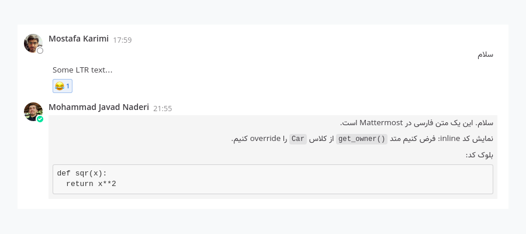
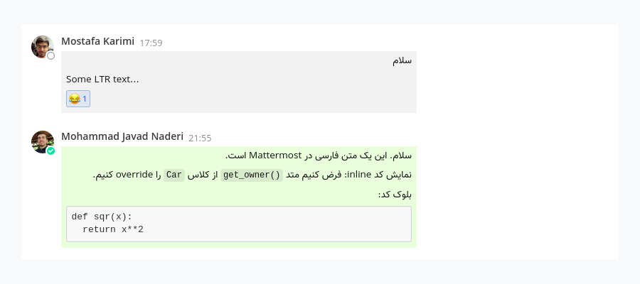

# Mattermost RTL

This plugin adds RTL support to Mattermost.

- Automatic direction for messages and text inputs.
- Changes font to [Vazir](https://github.com/rastikerdar/vazir-font)

**Before** enabling plugin:

**After** enabling plugin:

This plugin is also compatible with [mattermost-chat-ui](https://github.com/QueraTeam/mattermost-chat-ui), enabling both will result in:

This repository is based on
[mattermost-plugin-starter-template](https://github.com/mattermost/mattermost-plugin-starter-template).

## Installation

Download the plugin file (`ir.quera.mattermost-rtl-*.tar.gz`) from
[Releases](https://github.com/QueraTeam/mattermost-rtl/releases)
page and upload to your Mattermost
server via **System Console**.

## Development, Build

    make
